# 🐝 IndexHive

**IndexHive** is a centralized infrastructure & systems intelligence platform. It gives SRE, IT, and platform teams a single source of truth for every system, server, and service running across the organization — searchable, documented, and automatable from one place.

This is the **superproject**, tying together the three services that make up IndexHive:

| Module | Repo | Description |
|---|---|---|
| `Client` | [IndexHive-Client](https://github.com/OmriTurgeman100/IndexHive-Client) | React + TypeScript + Vite front end |
| `Server` | [IndexHive-Server](https://github.com/OmriTurgeman100/IndexHive-Server) | Core API, auth, and PostgreSQL-backed system registry |
| `Service` | [IndexHive-Docs](https://github.com/OmriTurgeman100/IndexHive-Docs) | Document indexing & search microservice |

Supporting infrastructure (via `docker-compose.yaml`): **PostgreSQL** for structured system data, **MinIO** (S3-compatible) for document storage.

---

## ✨ What you can do with IndexHive

### 🔎 Search every system in the organization
Instantly search across all registered systems, servers, and services from a single landing page — backed by live analytics on ownership, certification (SOC2 / ISO27001), network zones, and infrastructure types.

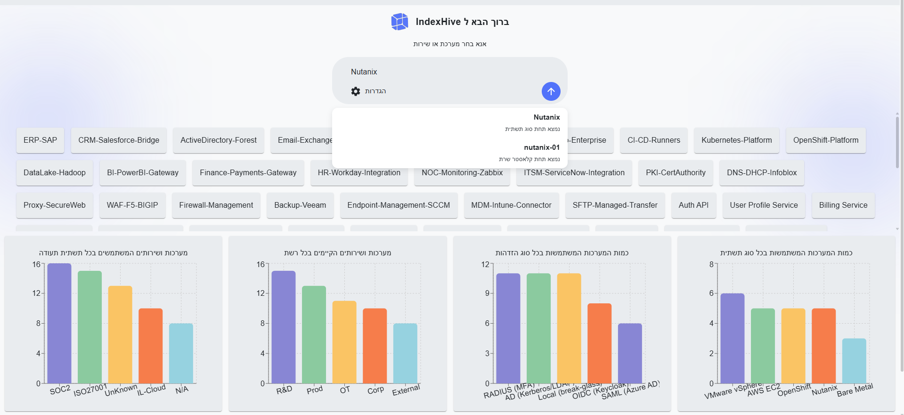

### 🖧 Find everything tied to a server, host, or IP
Search by hostname, IP, or any other server attribute to instantly surface every system running on it — so you know the blast radius and impact before touching a box, patching it, or taking it down.

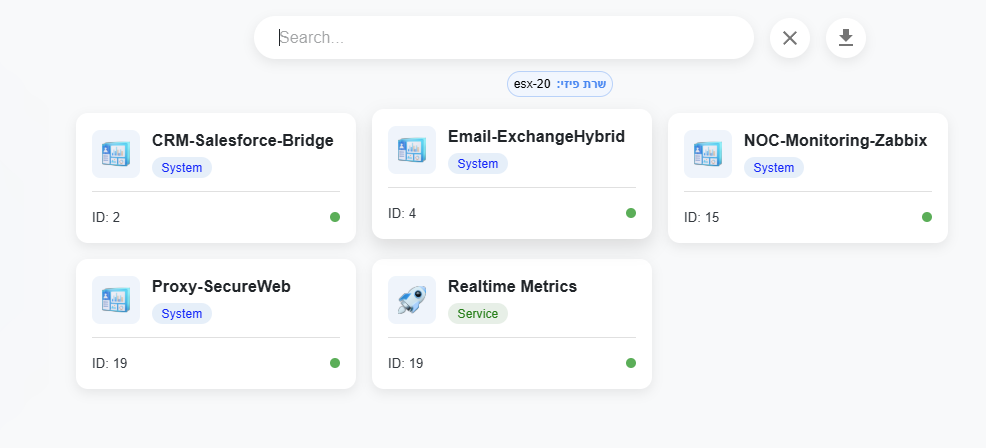

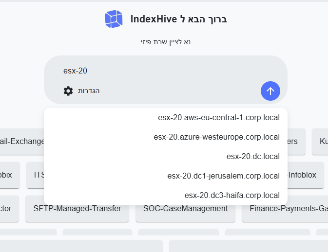

Results break down every matching system with its full server context — site location, network/VLAN, cluster, host, IP, rack, and type — so you can see exactly which services and systems depend on that piece of infrastructure.

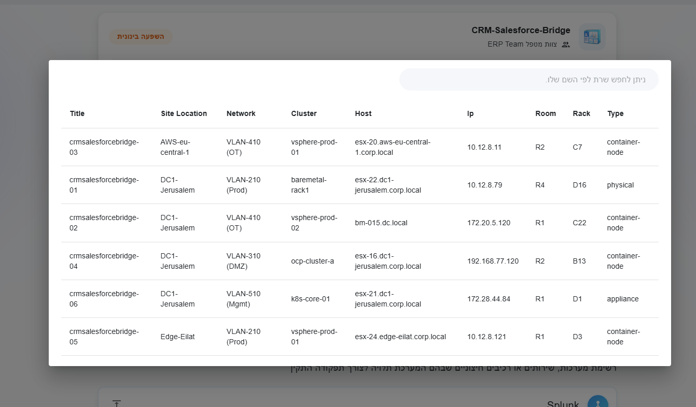

### 🎯 Filter results by type, network, or attribute
Narrow down large result sets instantly — for example, every system running on a specific infrastructure platform — with clean, glanceable cards showing status and ID at a glance.

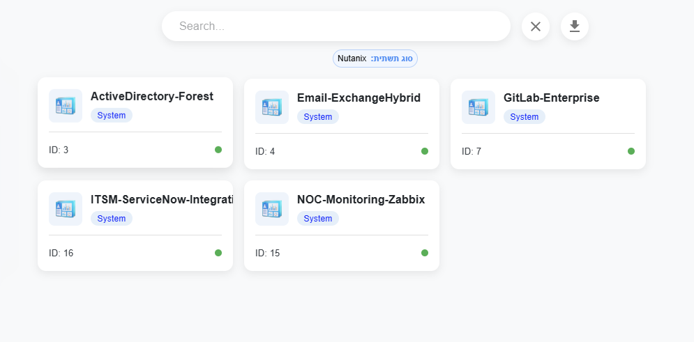

### 🧩 Combine multiple fields in one search
Stack filters together — environment, dependency, certification, and more — to zero in on exactly the systems that match every criterion at once, not just one.

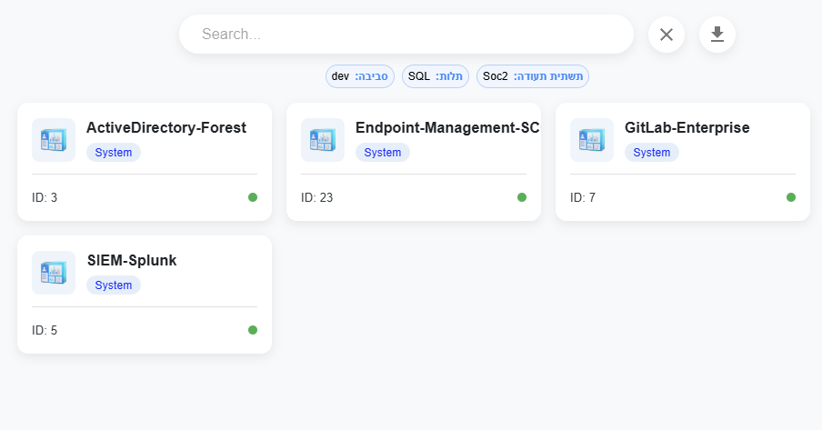

### 📋 See full data and context for each system
Open any system to see everything about it in one place — owning team, description, environment, network zone, certification, backup policy, mass/cluster, deployment sites, and every dependency it relies on.

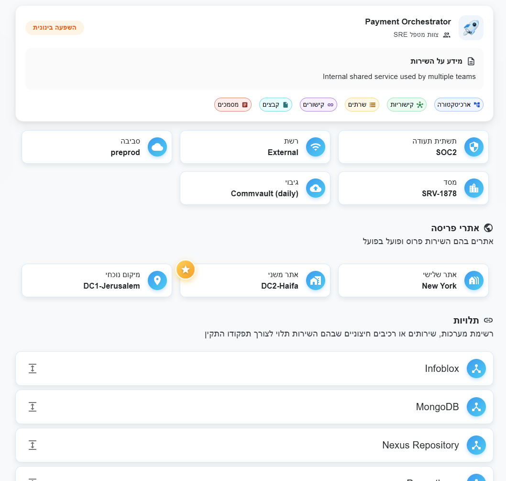

### 🖥️ Drill into server & host inventory
Every system expands into its full host inventory: site location, network/VLAN, cluster, hypervisor host, IP, rack, and hardware type — plus linked dependencies to other services.

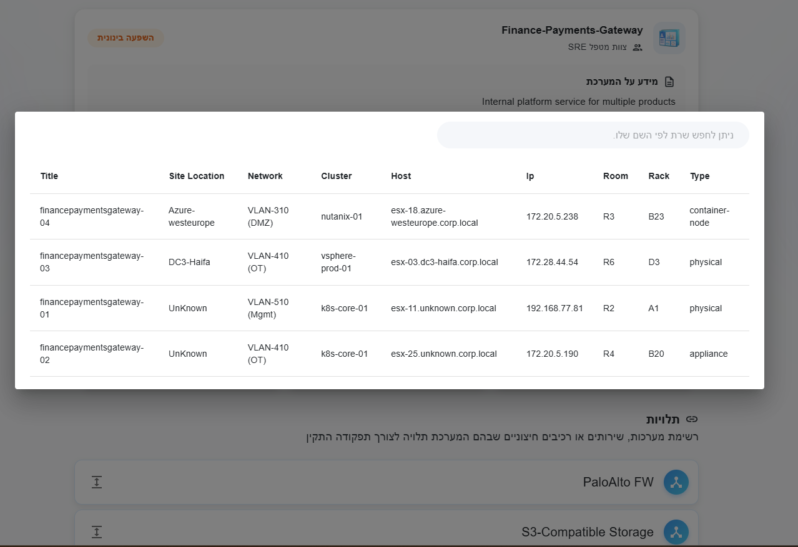

### 🌳 Visualize system architecture as a dependency tree
Explore any system's full dependency graph — authentication methods, upstream/downstream dependencies, network zones, and every underlying server — as an interactive node graph, or as a collapsible tree table with per-branch counts.

**Interactive node graph:**

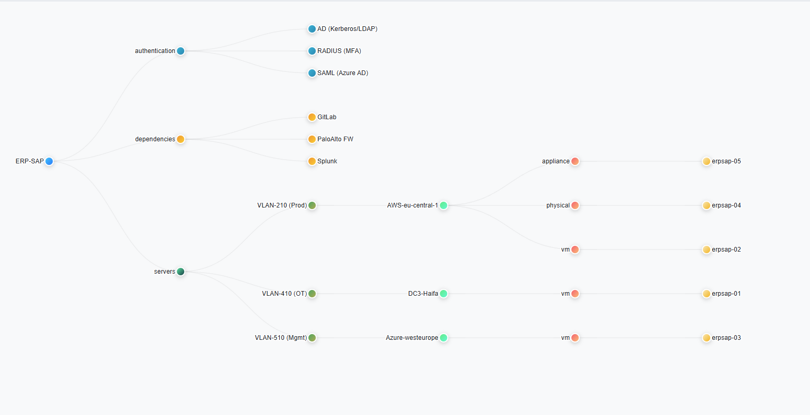

**Collapsible tree table:**

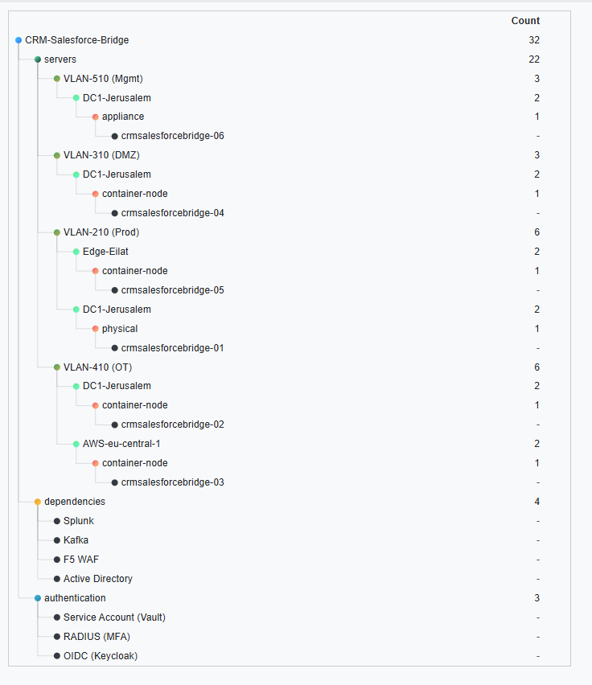

### 🌍 Real-time environment & location map
See exactly what's deployed where — every site, grouped by environment (dev / staging / production / preprod / test) — for a live, geography-aware view of the estate.

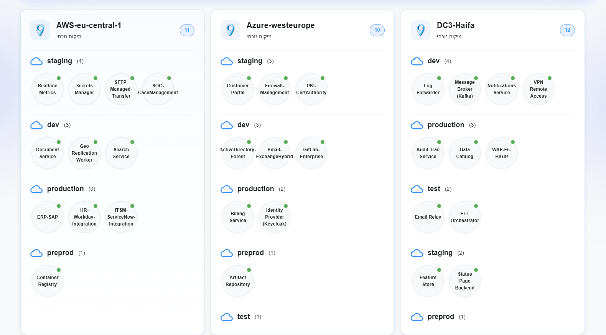

### 📄 Smart, content-aware documentation search
Go beyond system metadata — search *inside* documentation content itself, with AI-assisted regex-powered querying to find exactly what you need.


### 📝 Jump straight to the matching document
Search results deep-link into the actual document, with matches highlighted in context — no more digging through pages of runbooks.

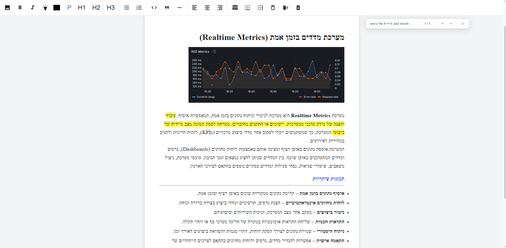

### ⚙️ Run automations remotely
Trigger and manage remote scripts directly from the portal — no SSH session required. Search your script library by title or description and execute with one click.

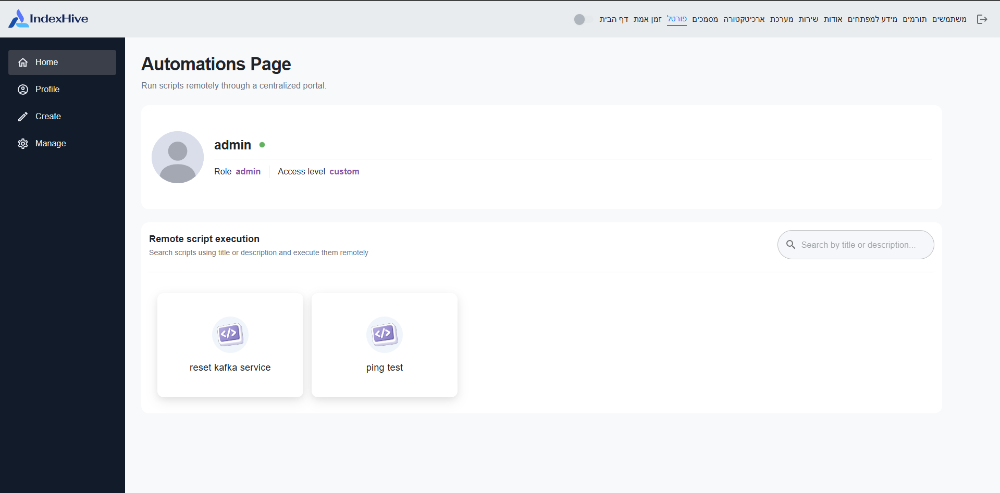

---

## 🏗️ Architecture

```
IndexHive-Superproject/
├── Client/    → React front end
├── Server/    → API, auth, system registry (PostgreSQL)
├── Service/   → Document indexing & search
└── docker-compose.yaml
```

## 🚀 Getting started

```bash
git clone --recurse-submodules <this-repo-url>
cd IndexHive-Superproject
docker-compose up --build
```

| Service | Port |
|---|---|
| Client | `80` |
| Server (API) | `3000` |
| MinIO Console | `9001` |
| MinIO API | `9000` |
